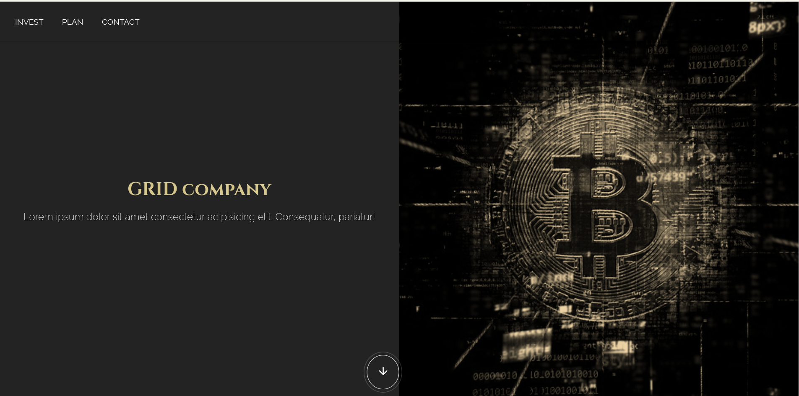

# GRID-based website design

## General Information
Website design for a sample corporate investment company. The site presents information about the company, its services and unique features. In addition, several posts can be found to help customers learn more about investing in the items.

## Technologies
Project is created with:
* HTML
* CSS with SASS
* JavaScript

## Features
- the website is responsive and uses Media Queries,
- fixed-position navigation,
- a lot of micro-interactions and hover changes,
- efficient and fast navigation of the site, 
- interesting style to match the service.

## Acknowledgements
The design of the website was created while learning the course "WEBSITE CREATION COURSE" from MMC School (https://mmcschool.pl/kursy/kurs-tworzenia-stron-www-cz-3.html)

## Contact
Feel free to contact me:
 
Email: aleksandrawypych.p@gmail.com
 
Portfolio: https://www.behance.net/aleksanwypych-p
